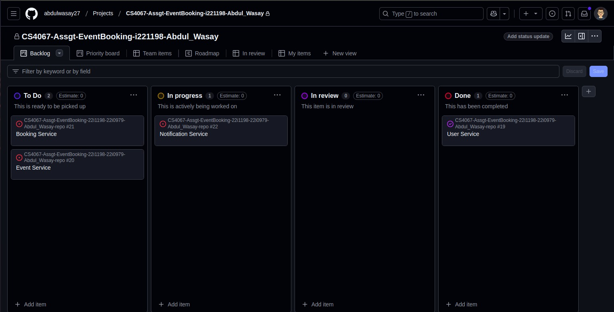
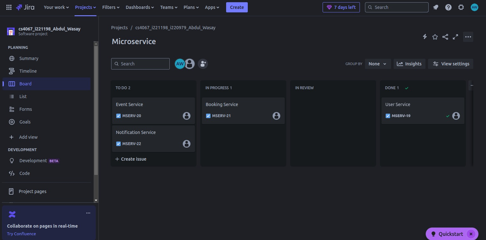

# Event Management System

## Architecture Overview
The system follows a microservices architecture, where each service is responsible for a specific functionality. The key services include:

1. **User Service** - Manages user authentication and details.
2. **Event Service** - Handles event creation and management.
3. **Booking Service** - Manages ticket bookings.
4. **Notification Service** - Stores and retrieves notifications for users.

Each service interacts via REST APIs, and PostgreSQL is used for data storage.

## Architecture Diagram


---

## API Documentation

### User Service
#### Register a User
- **Endpoint:** `POST /user`
- **Description:** Registers a new user.
- **Request Body:**
  ```json
  {
    "email": "user@example.com",
    "password": "securepassword"
  }
  ```
- **Response:**
  ```json
  {
    "message": "User registered successfully!"
  }
  ```
- **Errors:**
  - `400 Bad Request`: Missing fields.
  - `400 Bad Request`: User already exists.
  - `500 Internal Server Error`: Database error.

---

### Event Service
#### Get All Events
- **Endpoint:** `GET /events`
- **Description:** Retrieves all events.
- **Response:**
  ```json
  [
    {
      "event_id": 1,
      "name": "Tech Conference 2025",
      "location": "New York"
    }
  ]
  ```

#### Get Event by ID
- **Endpoint:** `GET /events/:id`
- **Description:** Fetches a specific event by ID.
- **Response:**
  ```json
  {
    "event_id": 1,
    "name": "Tech Conference 2025",
    "location": "New York"
  }
  ```
- **Errors:**
  - `404 Not Found`: Event not found.

#### Create an Event
- **Endpoint:** `POST /events`
- **Description:** Creates a new event.
- **Request Body:**
  ```json
  {
    "name": "Tech Conference 2025",
    "location": "New York"
  }
  ```
- **Response:**
  ```json
  {
    "message": "Event Created",
    "event": {
      "event_id": 1,
      "name": "Tech Conference 2025",
      "location": "New York"
    }
  }
  ```
- **Errors:**
  - `500 Internal Server Error`: Database error.

#### Update an Event
- **Endpoint:** `PUT /events/:id`
- **Description:** Updates an existing event.
- **Request Body:**
  ```json
  {
    "name": "Updated Event Name",
    "location": "Updated Location"
  }
  ```
- **Response:**
  ```json
  {
    "message": "Event Updated",
    "event": {
      "event_id": 1,
      "name": "Updated Event Name",
      "location": "Updated Location"
    }
  }
  ```
- **Errors:**
  - `404 Not Found`: Event not found.
  - `500 Internal Server Error`: Database error.

#### Delete an Event
- **Endpoint:** `DELETE /events/:id`
- **Description:** Deletes an event.
- **Response:**
  ```json
  {
    "message": "Event Deleted",
    "event": {
      "event_id": 1,
      "name": "Tech Conference 2025",
      "location": "New York"
    }
  }
  ```
- **Errors:**
  - `404 Not Found`: Event not found.
  - `500 Internal Server Error`: Database error.

---

### Booking Service
#### Create a Booking
- **Endpoint:** `POST /booking`
- **Description:** Books tickets for an event.
- **Request Body:**
  ```json
  {
    "email": "user@example.com",
    "event_id": 1,
    "tickets": 2
  }
  ```
- **Response:**
  ```json
  {
    "message": "Booking Successful!"
  }
  ```
- **Errors:**
  - `400 Bad Request`: Missing fields.
  - `400 Bad Request`: Duplicate booking.
  - `500 Internal Server Error`: Database error.

---

### Notification Service
#### Create a Notification
- **Endpoint:** `POST /notifications`
- **Description:** Stores a new notification.
- **Request Body:**
  ```json
  {
    "email": "user@example.com",
    "event_name": "Tech Conference 2025"
  }
  ```
- **Response:**
  ```json
  {
    "message": "Notification stored successfully!",
    "notification": {
      "email": "user@example.com",
      "event_name": "Tech Conference 2025"
    }
  }
  ```
- **Errors:**
  - `400 Bad Request`: Missing fields.
  - `500 Internal Server Error`: Database error.

#### Get All Notifications
- **Endpoint:** `GET /notifications`
- **Description:** Retrieves all stored notifications.
- **Response:**
  ```json
  [
    {
      "email": "user@example.com",
      "event_name": "Tech Conference 2025"
    }
  ]
  ```
- **Errors:**
  - `500 Internal Server Error`: Database error.

---

## Setup Guide

### Prerequisites
- Node.js & npm
- Python 3
- PostgreSQL
- Docker (optional)

### Installation Steps
1. Clone the repository:
   ```sh
   git clone https://github.com/abdulwasay27/CS4067-Assgt-EventBooking-22i1198-22i0979-Abdul_Wasay-repo.git
   cd services
   ```

2. Install dependencies:
   ```sh
   cd user-service && npm install
   cd ../event-service && npm install
   cd ../booking-service && npm install
   cd ../notification-service && npm install
   ```

3. Setup PostgreSQL:
   - Configure `.env` files in each service.
   - Run migrations if applicable.

4. Start the services:
   ```sh
   cd user-service && npm start
   cd ../event-service && npm start
   ```

5. Test APIs using Postman or Curl.

---

# Project Screenshots





---

